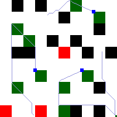

# Swarm Intelligence

 

 

 


## Problem Description
The problem is based on the world of zooids, where you are their master. The world of zooid is a grid of dimensions 200 x 200. As in any real world, obstacles are occupying some portions of the grid. The obstacles are strictly rectangular. Here is a sample image    



Each zooid has basic locomotion capabilities, moving from one grid cell to another. Zooids can move in a specific order: 1, 2, 3, 4, 5, 6, 7, 8, and back to 1. The obstacles are impassable, marked in black, while green regions are to be visited, and red regions should be avoided.

### Levels

1. **Level 1**: You must guide a single zooid (Zoozoo) from its initial position to its destination with the fewest steps possible. This is a single-agent, single-objective system.

2. **Level 2**: Zoozoo now needs to visit all the green regions. This is still a single-agent system but with multiple objectives.

3. **Level 3**: Zoozoo has a friend, and they need to cooperate to visit all the green regions efficiently. This introduces a multi-agent, multi-objective system.

4. **Level 4**: Zoozoo and friends are part of a swarm of zooids, and there are multiple green regions to visit. Can they cooperate effectively as a group? This explores the concept of swarm systems.

5. **Level 5**: Zoozoo and a friend face a tougher challenge with red regions. They should avoid red regions but may need to pass through them strategically to reach green regions efficiently. This requires more intelligent decision-making.

6. **Level 6**: A swarm of zooids joins Zoozoo and friends, marking the beginning of swarm intelligence. Can you program them to work together effectively?

## How to Run

This project should be run on an Ubuntu (>18.04) system or within Windows Subsystem for Linux (WSL) with Ubuntu 18.04.

1. Clone this repository:

    ```shell
    unix_user@DESKTOP:~$ cd
    unix_user@DESKTOP:~$ git clone https://github.com/shreyase99/SwarmSoftwareTask2021
    unix_user@DESKTOP:~$ cd SwarmSoftwareTask2021
    ```

2. Grant execution permissions to `setup.sh` and `run.sh`:

    ```shell
    unix_user@DESKTOP:~/SwarmSoftwareTask2021$ chmod +x setup.sh
    unix_user@DESKTOP:~/SwarmSoftwareTask2021$ chmod +x run.sh
    ```

### First Run

3. In one terminal, run the following to set up the environment and start the map server:

    ```shell
    unix_user@DESKTOP:~/SwarmSoftwareTask2021$ ./setup.sh
    ```

   You should see the following message:

   ```
   Running on http://127.0.0.1:5000/ (Press CTRL+C to quit)
   ```

4. In another terminal, run the following command to select the level you want to attempt:

    ```shell
    unix_user@DESKTOP:~/SwarmSoftwareTask2021$ python3 controller.py
    ```

   You will be prompted to enter a level, starting from 1 and progressing to level 6. The `controller.py` sets up the level, creates bots in the map, and uses the solution written in `code.py` to control the bots.

5. To view the map of the simulation, open the `showMap.html` file in your browser.

### Running in WSL

If you are using WSL, you can open Windows Explorer from inside the repository directory using the following command (ensure you're in the correct directory):

```shell
unix_user@DESKTOP:~/SwarmSoftwareTask2021$ Explorer.exe .
```

Locate the `showMap.html` file and open it in your browser. The map on the webpage updates every 1 second. You can also try opening `http://localhost:5000/map` in your browser if you're curious.

### Note for Future Runs

Instead of running `setup.sh` every time, which may take extra time confirming dependencies, you can directly use:

```shell
unix_user@DESKTOP:~/SwarmSoftwareTask2021$ ./run.sh
```

You only need to stop/restart the `run.sh` process when it has been stopped (Ctrl+C).

## What's Next?

Your task is to complete as many functions/levels as possible in `code.py` and submit your codes through the teams assignment. Attempting more levels increases your chances of getting into the team. Your functions may not always be optimal, but we will evaluate your problem-solving approach and effort.

## Code Structure

There is one main file named `code.py`, which you must edit and fill out. You're encouraged to use solutions from lower levels to solve higher-level problems. Refer to the documentation in `api.py` if you're unsure about what a command does.

## Working Procedure

- `app.py` maintains the grid, bot positions, and handles multiple command requests.
- `controller.py` sets up the levels, simulates multiple bots using threads, and coordinates their actions.
- `code.py` uses functions from `api.py` to send commands to `app.py`, simulating the zooid world.
- `simulation.py` constantly fetches and displays the current map. It may not work in WSL without GUI support. To close it, press Ctrl+C in the terminal where it's running.
